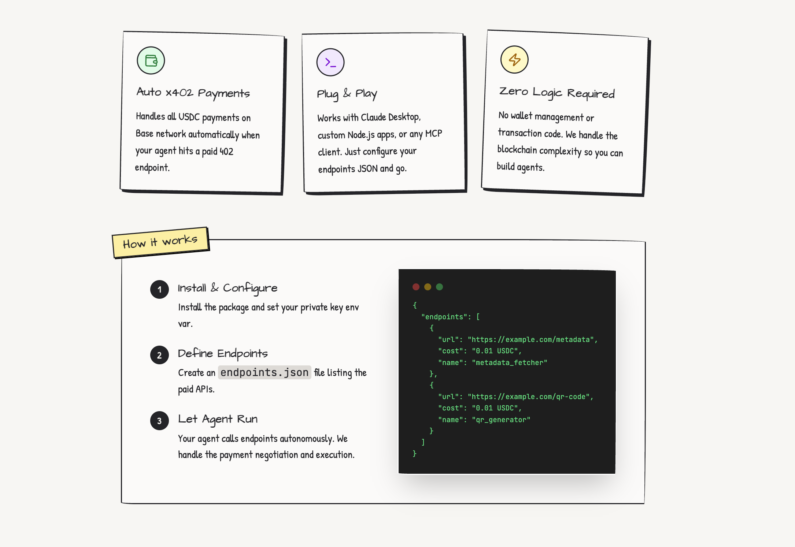

# x402 Agent Boilerplate

**Build AI Agents That Pay For What They Need**

This is a demo and starter template showing how to connect any LLM to x402 payment endpoints. Build your own agent app by customizing the `x402-endpoints.json` file.



## Quick Start

### Option 1: Use the Boilerplate (Recommended)

Create a new x402 agent app with one command:

```bash
npx x402-agent-app
```

This scaffolds a full-stack app with:
- React frontend with CDP wallet integration
- OpenAI chat backend
- x402 payment handling
- Pre-configured endpoints

Then:
```bash
cd my-agent-app
# Add your API keys to .env
npx vercel dev
```

### Option 2: Clone This Demo

```bash
git clone https://github.com/Must-be-Ash/x402-agent-demo-app.git
cd x402-agent-demo-app
npm install
npx vercel dev
```

**Note:** The CLI (`npx x402-agent-app`) gives you a clean project with your own name. Cloning gets you this exact demo with git history.

## Features

### One Command Setup
Run `npx x402-agent-app` to get a fully configured agent app with React, OpenAI, CDP wallet, and x402 payment integration.

### Configurable Endpoints
Edit `x402-endpoints.json` to define which paid APIs your agent can access. The LLM automatically selects the right endpoint based on user requests.

### Built-In Payments
Users pay with their CDP embedded wallet. USDC transactions on Base network happen automatically when calling x402 endpoints—no payment code needed.

## How It Works

### User-Pays Architecture Flow

1. **User Signs In**: User authenticates with CDP embedded wallet (email/SMS OTP)
2. **User Asks for Service**: "Generate a QR code for x402.org"
3. **AI Selects Endpoint**: OpenAI function calling picks the right x402 endpoint
4. **Server Returns Action**: API responds with endpoint details and estimated cost
5. **Client Executes Payment**: `useX402` hook automatically handles:
   - Detecting 402 Payment Required response
   - Creating and signing payment transaction with user's wallet
   - Including payment proof in retry request
6. **Display Results**: QR code image, payment confirmation, and summary shown to user

### Architecture Benefits

- **User autonomy**: Users control their own funds and spending
- **Scalable**: No server wallet to fund or manage
- **Transparent**: Users see costs upfront
- **Secure**: Payments signed client-side with user's keys
- **Simple**: CDP handles all payment complexity

### Customizing Your Agent

**The key to customization is `x402-endpoints.json`**. This file defines which paid APIs your agent can access:

```json
{
  "endpoints": [
    {
      "id": "qr_code_generator",
      "name": "Generate QR Code",
      "url": "https://example.com/qr-code",
      "method": "GET",
      "description": "Generates a QR code image for any URL",
      "estimatedCost": "$0.01",
      "parameters": {
        "type": "object",
        "properties": {
          "url": {
            "type": "string",
            "description": "The URL to encode"
          }
        },
        "required": ["url"]
      }
    }
  ]
}
```

**That's it!** Add any x402 endpoint to this file and your agent will automatically know how to call it. The LLM uses the descriptions to select the right endpoint for each user request.

## Tech Stack

- **Frontend**: React 18.2 + Vite + TypeScript + Tailwind CSS
- **Backend**: Vercel Serverless Functions
- **AI**: OpenAI GPT-4o-mini with function calling
- **Wallet**: Coinbase Developer Platform (CDP) Embedded Wallets
- **Payments**: CDP `useX402` hook - users pay with their own wallet
- **Blockchain**: Base (USDC payments)
- **Deployment**: Vercel

## Payment Model

This demo uses **user wallet payments** via the CDP `useX402` hook:

- **Users pay**: Each user pays for x402 API calls with their own embedded wallet
- **Client-side execution**: x402 calls are made directly from the browser
- **Automatic payment handling**: The `useX402` hook handles 402 responses, payment signatures, and retries
- **Transparent pricing**: Users see the estimated cost before the AI makes a call
- **No server costs**: The server only provides AI logic, not payment execution

## Running Locally

### Prerequisites

- Node.js 22+
- npm or pnpm
- Vercel CLI (for local serverless functions)

### Environment Variables

Create a `.env` file:

```env
# OpenAI
OPENAI_API_KEY=your_openai_api_key

# Coinbase Developer Platform
VITE_CDP_PROJECT_ID=your_cdp_project_id
CDP_API_KEY_ID=your_cdp_api_key_id
CDP_API_KEY_SECRET=your_cdp_api_key_secret
```

### Development

#### Option 1: Vercel CLI (Recommended)
Runs both frontend and serverless functions:

```bash
# Install Vercel CLI globally
npm install -g vercel

# Start development server
vercel dev
```

#### Option 2: Frontend Only
For UI development with mock data:

```bash
npm run dev
```

### Build

```bash
npm run build
```

### Type Check

```bash
npm run check
```

## Deployment

### Deploy to Vercel

1. **Install Vercel CLI:**
   ```bash
   npm install -g vercel
   ```

2. **Login to Vercel:**
   ```bash
   vercel login
   ```

3. **Deploy:**
   ```bash
   vercel
   ```

4. **Set Environment Variables in Vercel Dashboard:**
   - `OPENAI_API_KEY`
   - `CDP_API_KEY_ID`
   - `CDP_API_KEY_SECRET`
   - `VITE_CDP_PROJECT_ID`

5. **Deploy to Production:**
   ```bash
   vercel --prod
   ```

## Security

This demo implements server-side CDP access token validation to ensure only authenticated users can access the chat API. Users must complete the embedded wallet authentication flow (email/SMS OTP) before chatting.

**Session Flow:**
- Access tokens: 15-minute expiry
- Refresh tokens: 7-day expiry
- Automatic token refresh
- Server-side validation on all API calls

## Documentation

For more details on the architecture and implementation, see:
- [CLAUDE.md](CLAUDE.md) - Comprehensive developer documentation
- [CDP Embedded Wallets Docs](https://docs.cdp.coinbase.com/embedded-wallets/)
- [x402 Protocol](https://x402.org)

## Contributing

Contributions are welcome! Feel free to:
- Open issues for bugs or feature requests
- Submit pull requests
- Fork and customize for your own use cases

## Author

**Built by [@must_be_ash](https://x.com/must_be_ash)**

- Twitter: [@must_be_ash](https://x.com/must_be_ash)
- GitHub: [Must-be-Ash](https://github.com/Must-be-Ash)

## License

MIT

## Links

- [NPM Package](https://www.npmjs.com/package/x402-agent-app) - `npx x402-agent-app`
- [GitHub Repository](https://github.com/Must-be-Ash/x402-agent-demo-app) - This demo
- [CLI Repository](https://github.com/Must-be-Ash/create-x402-agent-npm) - Boilerplate source
- [Live Demo](https://x402-agent.vercel.app) - See it in action
- [x402 Protocol](https://x402.org) - Payment protocol docs
- [Coinbase Developer Platform](https://portal.cdp.coinbase.com) - Get API keys

---

**Start building x402 agents today:** `npx x402-agent-app my-app`
